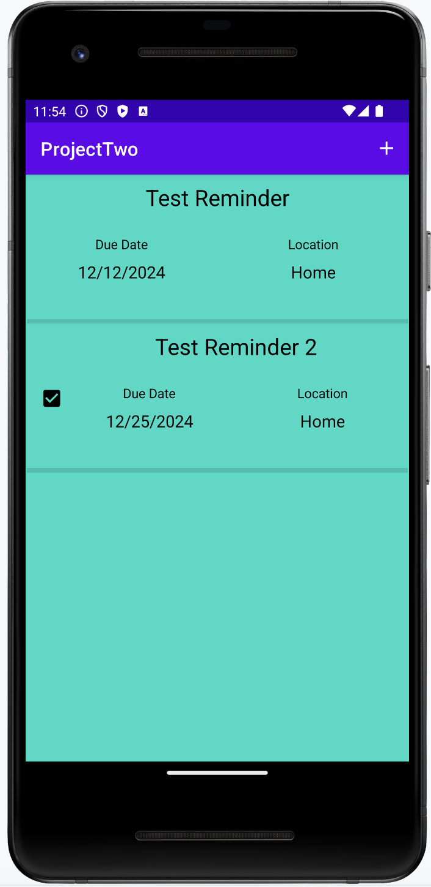
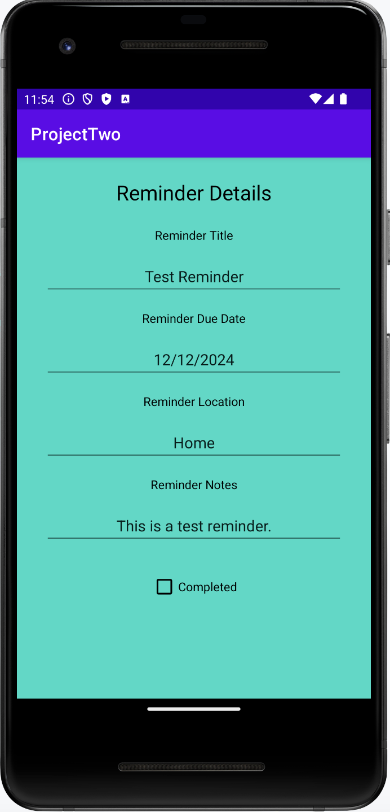

# Reminders App

This is a project app I developed for my SE-3010 Mobile Application Development for Android.  It uses two fragments with their own layout and ViewModel, one showing a list of reminders and the other showing details of a single reminder, each with their own custom layout using a ConstraintLayout.  It also uses a Main Activity to host both of the fragments.  The list fragment also uses a RecyclerView, Adapter, and ViewHolder to create a scrollable list.  

